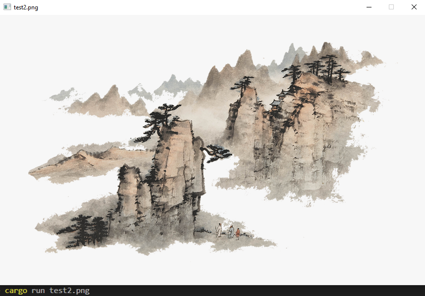

# Rust PNG Viewer

Rust PNG Viewer is partial implementation of the [PNG Specification 1.2](http://www.libpng.org/pub/png/spec/1.2/PNG-Contents.html). All the parsing done 
was done using no libraries and as close to the specification as I could implement. However, I did rely on the miniz_oxide's zlib implementation for the inflate/decompress algorithm. For the display, I rely on the minifb crate for a window and algorithimically draw the pixels onto the window.

## Current State
The program can currently validate a valid PNG file and read through and parse all chunks. The program currently works with RGBA encoded PNG's and is fully integrated with the minifb library.

## Installation

```sh
git clone 
cd rust-png
cargo run %filename%.png
```

## Motivation
After watching: [this video by Tsoding](https://www.youtube.com/watch?v=M9ZwuIv3xz8), I gained an interest in wondering what the insides of a PNG look like. In combination with my interest in picking up rust, I decided that this would be a perfect beginner project.

## Example 
When running the ```sh  cargo run test2.png```, this is an example output.



## TODOS

 - [ ] Verify the CRC's of chunks
 - [ ] Add my own visual compression 
 - [ ] Implement filtering 
 - [ ] Gamma Correction 


## Note

This is partial implementation of the spec, having only implmented the interpretation of IHDR,IDAT, and IEND chunks. The goal of this project was to 
build a foundation for a full implementation by building a parser and having it be able to render to a canvas. 


### Contribution

Feel free to contribute in any way you can :) 
